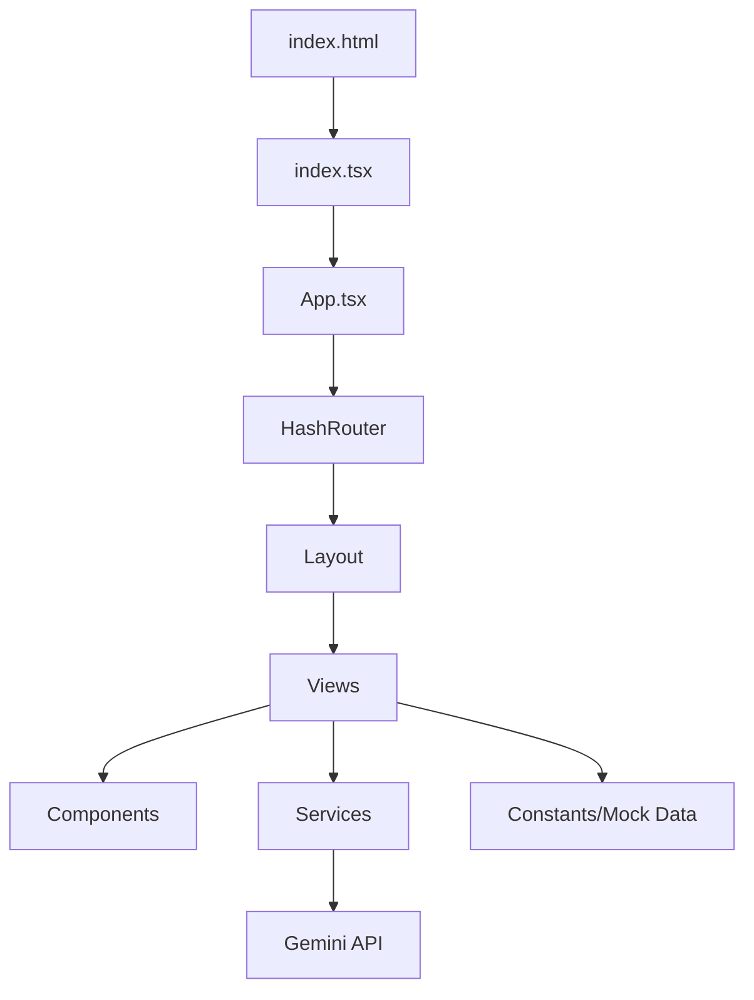

# OUTDOG 项目设计文档

## 1. 项目概述

**OUTDOG** 是一个专为蓝领群体（工友）打造的社区互动与电商综合平台。项目旨在通过社交互助与专业电商服务的结合，提升工友们的工作与生活品质。

### 核心价值
- **社区互助**：分享工作日常，求职招聘互助，法律咨询避坑。
- **专业电商**：提供为蓝领量身定制的耐用工具与生活用品。
- **AI 赋能**：集成 Gemini AI，为用户提供智能回复与内容辅助。

---

## 2. 技术栈

| 维度 | 技术选型 | 备注 |
| :--- | :--- | :--- |
| **前端框架** | React 19 | 最新的 React 特性支持 |
| **路由管理** | React Router 7 | 使用 HashRouter 确保兼容性 |
| **开发工具** | Vite + TypeScript | 极速热更新与类型安全 |
| **样式设计** | Tailwind CSS | 通过 CDN 引入，响应式设计 |
| **AI 能力** | Google Gemini API | `@google/genai` 官方 SDK |
| **图标库** | Material Icons | 提供直观的 UI 交互体验 |

---

## 3. 系统架构

项目采用模块化前端架构，通过 `services` 层封装外部 API 调用。

---

## 4. 功能模块

### 4.1 社区广场 (Community)
- **动态流**：支持分类展示（工作互助、生活闲聊、法律咨询等）。
- **内容互动**：支持点赞、评论、置顶、禁言等功能。
- **发布系统**：支持文字与多图片上传。

### 4.2 蓝领商城 (Shop)
- **商品展示**：专业工具集、生活用品展示。
- **购物车与结算**：完整的下单流程，模拟支付逻辑。
- **订单追踪**：查看订单状态（待发货、已签收等）。

### 4.3 社交与私信 (Communication)
- **私信系统**：用户间一对一实时聊天模拟。
- **通知中心**：系统通知、点赞、评论提醒。
- **关注系统**：支持关注/粉丝机制。

### 4.4 个人中心 (Profile & Settings)
- **个人资料管理**：修改头像、介绍、手机号。
- **账户安全**：设置隐私与账户权限。

---

## 5. 数据模型

项目核心数据结构定义于 `types.ts`。

| 模型 | 关键字段 | 作用 |
| :--- | :--- | :--- |
| `User` | id, name, avatar, bio, following, followers | 用户信息展示 |
| `Post` | id, author, title, content, images, categories | 动态帖子数据 |
| `Product` | id, name, price, originalPrice, image, specs | 商品详情 |
| `Order` | id, items, totalAmount, status, timestamp | 订单管理 |
| `Comment` | id, author, content, likes, replies | 互动评论 |

---

## 6. UI/UX 设计规范

### 视觉风格
- **主色调**：`#FB923C` (Primary Orange) - 充满活力与温度。
- **夜间模式**：支持 `dark` 模式切换，深蓝背景色集。
- **字体**：`Noto Sans SC` (思源黑体) - 极致的中文阅读体验。

### 交互亮点
- **抛物线加入购物车**：生动的动效反馈。
- **玻璃化视觉 (Glassmorphism)**：下拉菜单与卡片背景。
- **微动效**：按钮震动反馈、成功弹出层。

---

## 7. 未来扩展计划

- [ ] **多端适配**：进一步优化移动端 PWA 体检。
- [ ] **AI 简历助手**：利用 Gemini 帮助工友自动生成求职简历。
- [ ] **真实支付接入**：集成微信/支付宝 SDK。
- [ ] **实时通讯后端**：引入 WebSocket 实现真实的实时聊天。
